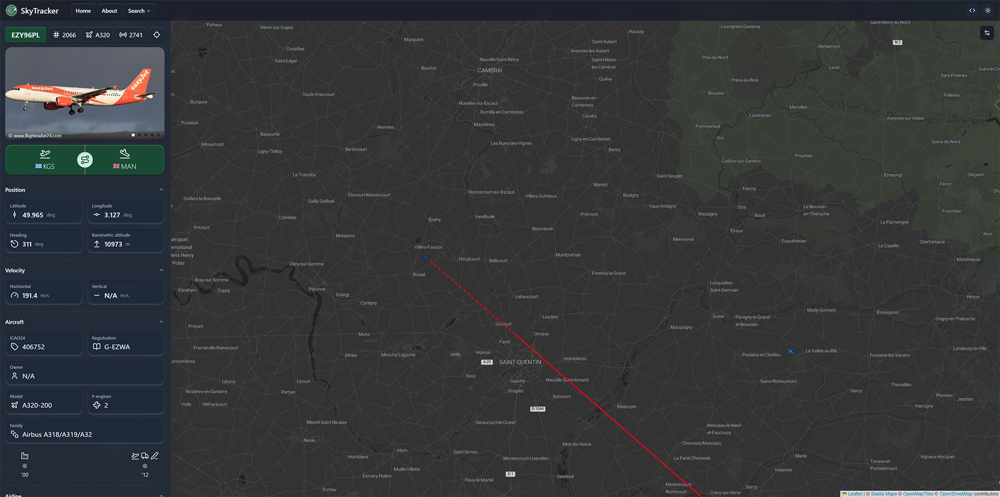
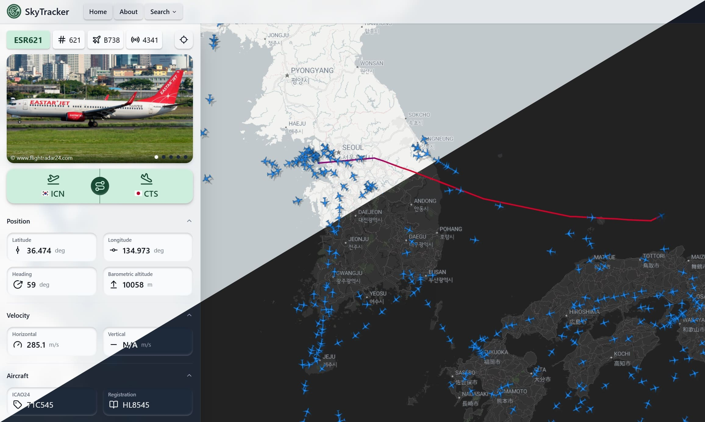
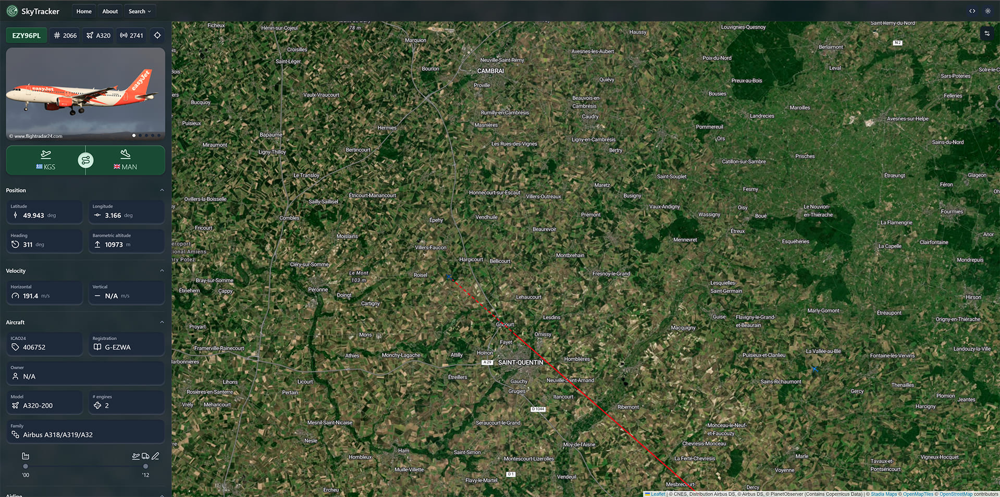
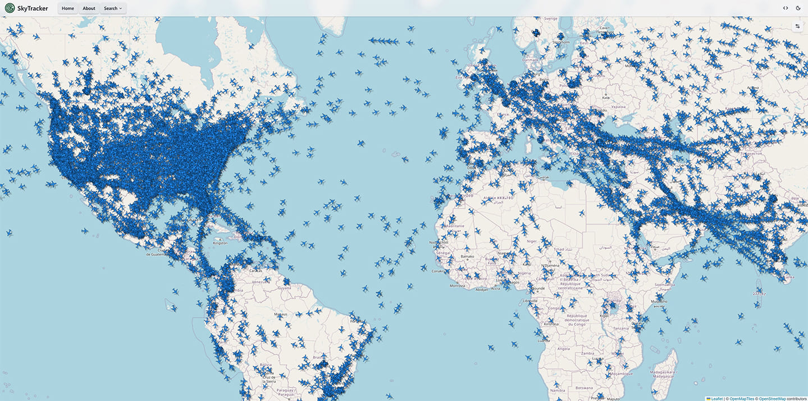
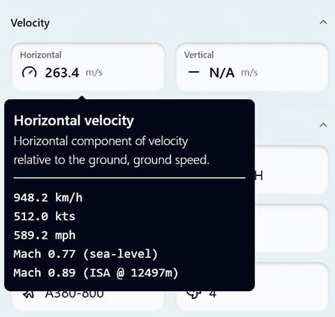
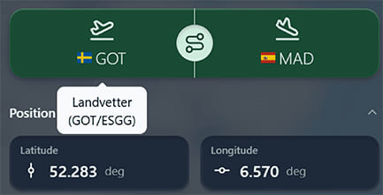

# SkyTracker (monorepo)

[](https://github.com/JasperJeuken/SkyTracker)
[](https://skytracker.readthedocs.io/en/latest/)
[](https://skytracker.readthedocs.io/en/latest/)

Tool for tracking and visualizing aircraft around the world. This mono-repository contains both the Python backend ([`src`](src)) and React frontend ([`frontend`](frontend)).

> **_NOTE:_**  This is a hobby project and unfinished/unpolished

#### Quick links
- [Backend](#backend)
- [Frontend](#frontend)
- [Gallery](#gallery)

  
*Screenshot of interactive aircraft map*

# Backend
The backend of the application is written in Python. Functionality includes:
- Aircraft ADS-B data collection from multiple sources ([OpenSky Network](https://opensky-network.org/), [Aviation Edge](https://aviation-edge.com/), ...)
- Data storage in [ClickHouse](https://clickhouse.com/) server (local or cloud-based)
- Various database queries with cache optimization
- Web API endpoints using [FastAPI](https://fastapi.tiangolo.com/)

The package structure is modular and asynchronous. Collection services can run in parallel to other functionality.
Abstracted database management allows for expansion and future analyses. See the [API reference](https://skytracker.readthedocs.io/en/latest/) for more details.

## Usage
Using the application requires setting up a [ClickHouse](https://clickhouse.com/) database, and acquiring [OpenSky Network API](https://openskynetwork.github.io/opensky-api/index.html)
credentials. Please follow the steps outlined on the [`Getting started`](https://skytracker.readthedocs.io/en/latest/getting_started.html) page of the documentation for installation and usage.

### Available endpoints

There are several endpoints available in the `v1` API. For more details, view the [documentation](https://skytracker.readthedocs.io/en/latest/).

| **Category** | **Endpoint**                            | **Description**                           |
|--------------|-----------------------------------------|-------------------------------------------|
| Aircraft     | `api/v1/aircraft/{registration}`        | Get details of a specific aircraft        |
|              | `api/v1/aircraft/{registration}/photos` | Get photos of a specific aircraft         |
|              | `api/v1/aircraft?`                      | Search for an aircraft                    |
| Airport      | `api/v1/airport/{iata}`                 | Get details of a specific airport         |
|              | `api/v1/airport?`                       | Search for an airport                     |
| Airline      | `api/v1/airline/{icao}`                 | Get details of a specific airline         |
|              | `api/v1/airline?`                       | Search for an airline                     |
| State        | `api/v1/state/nearby`                   | Get aircraft states near a specific point |
|              | `api/v1/state/area`                     | Get aircraft states within a bounding box |
|              | `api/v1/state/{callsign}/latest`        | Get latest state of a specific aircraft   |
|              | `api/v1/state/{callsign}/history`       | Get state history of a specific aircraft  |
|              | `api/v1/state?`                         | Search for a state                        |

### Example: aircraft states in bounding box
```http
GET https://<host>/api/v1/state/area?south=50&north=60&west=5&east=20
```
```json
[
    {
        "time": "2025-01-01T00:00:00.000Z",
        "callsign": "ABC123",
        "model": "A380",
        "position": [52.3, 12.6],
        "heading": 59,
        "altitude": 9820.9,
        "velocity": 192.1,
    },
    ...
]
```

#### Example: aircraft details (from registration)
```http
GET https://<host>/api/v1/aircraft/ab-cde
```
```json
{
    "identity": {
        "icao24": "ABC123",
        "registration": "AB-CDE",
        "test_registration": "FG-HIJ",
        "owner": "Company Ltd",
        "airline_iata": "AA",
        "airline_icao": "AAL",
    },
    "model": {
        "type_iata": "A320-200",
        "type_iata_code_short": "A32",
        "type_iata_code_long": "A322",
        "engine_count": 2,
        "engine_type": "JET",
        "model_code": "A320-200",
        "line_number": 123,
        "serial_number": 12345678,
        "family": "A320",
        "sub_family": "Airbus A318/A319/A320",
        "series": "A32",
        "classification": "UNKNOWN",
    },
    "lifecycle": {
        "date_rollout": "1987-02-01",
        "date_first_flight": "2010-03-02",
        "date_registration": "2012-04-03",
        "date_delivery": "2012-05-04",
        "age": 13.5,
    },
    "status": "ACTIVE",
}
```

# Frontend
The frontend of the application is written with [React](https://react.dev/) and [Tailwind CSS](https://tailwindcss.com/). Functionality includes:
- Interactive aircraft map using [Leaflet](https://leafletjs.com/)
- Aircraft history and detail view

## Usage
With [NodeJS](https://nodejs.org/en) installed, use the following commands to install and run the frontend:

1. Move into the frontend directory:

    ```pwsh
    cd frontend
    ```

2. Install the required packages:

    ```pwsh
    npm install
    ```

3. Run the frontend (development, build, or preview):

    ```pwsh
    npm run dev
       or
    npm run build
       or
    npm run preview
    ```

# Gallery

  
*Support for light/dark mode*

  
*Support for satellite view*

  
*Worldwide coverage*


  
*Detailed information displays*
