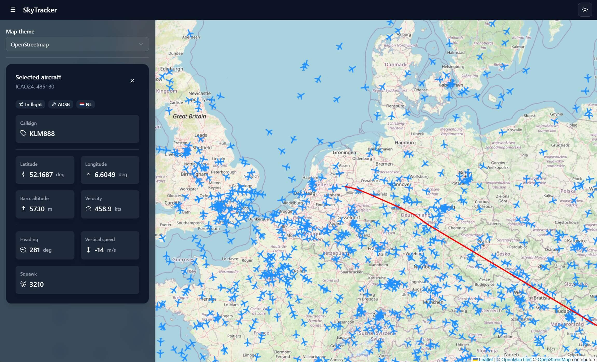

# SkyTracker (monorepo)

[](https://github.com/JasperJeuken/SkyTracker)
[](https://skytracker.readthedocs.io/en/latest/)
[](https://skytracker.readthedocs.io/en/latest/)

Tool for tracking and visualizing aircraft around the world. This mono-repository contains both the Python backend ([`src`](src)) and React frontend ([`frontend`](frontend)).

> **_NOTE:_**  This is a hobby project and unfinished/unpolished

#### Quick links
- [Backend](#backend)
- [Frontend](#frontend)


*Screenshot of interactive aircraft map*

# Backend
The backend of the application is written in Python. Functionality includes:
- Aircraft ADS-B data collection from the [OpenSky Network](https://opensky-network.org/)
- Data storage in [ClickHouse](https://clickhouse.com/) server (local or cloud-based)
- Various database queries with cache optimization
- Web API endpoints using [FastAPI](https://fastapi.tiangolo.com/)

The package structure is modular and asynchronous. Collection services can run in parallel to other functionality.
Abstracted database management allows for expansion and future analyses. See the [API reference](https://skytracker.readthedocs.io/en/latest/) for more details.

## Usage
Using the application requires setting up a [ClickHouse](https://clickhouse.com/) database, and acquiring [OpenSky Network API](https://openskynetwork.github.io/opensky-api/index.html)
credentials. Please follow the steps outlined on the [`Getting started`](https://skytracker.readthedocs.io/en/latest/getting_started.html) page of the documentation for installation and usage.

#### Example: aircraft states in bounding box
```http
GET http://<host>/api/v1/maps?lat_min=50&lat_max=60&lon_min=5&lon_max=20
```
```json
[
    {
        "icao24": "abcdef",
        "latitude": 52.6,
        "longitude": 6.3,
        "heading": 59,
    },
    ...
]
```

#### Example: aircraft details (from [ICAO 24-bit address](https://en.wikipedia.org/wiki/Aviation_transponder_interrogation_modes#ICAO_24-bit_address))
```http
GET http://<host>/api/v1/aircraft/abcdef
```
```json
{
    "icao24": "abcdef",
    "known_callsigns": ["AB-1234", "CD-5678"],
    "origin_country": "FR",
    "last_state": 1735686000,
    "last_position": 1735686000,
    "last_contact": 1735686000,
    "latitude": 52.6,
    "longitude": 6.3,
    "baro_altitude": 2143,
    "geo_altitude": 2135,
    "velocity": 121.3,
    "heading": 59,
    "vertical_rate": -5.2,
    "on_ground": false,
    "spi": false,
    "squawk": 1234,
    "position_source": "ADSB",
    "category": "HEAVY"
}
```

# Frontend
The frontend of the application is written with [React](https://react.dev/) and [Tailwind CSS](https://tailwindcss.com/). Functionality includes:
- Interactive aircraft map using [Leaflet](https://leafletjs.com/)
- Aircraft history and detail view

## Usage
With [NodeJS](https://nodejs.org/en) installed, use the following commands to install and run the frontend:

1. Move into the frontend directory:

    ```pwsh
    cd frontend
    ```

2. Install the required packages:

    ```pwsh
    npm install
    ```

3. Run the frontend (development, build, or preview):

    ```pwsh
    npm run dev
       or
    npm run build
       or
    npm run preview
    ```


# Current state
The application is still a work in progress. Currently, aircraft state collection is automated. Basic database interaction is implemented, allowing for interaction with a local or cloud-based ClickHouse server. Basic API endpoints are implemented, which are used to create an interactive aircraft map visualization.
